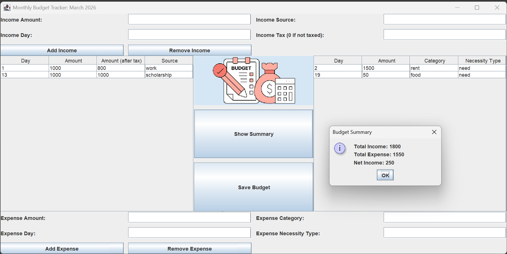

# Monthly Budget Tracker

A Java desktop and terminal application for tracking monthly income and expenses. Users can manage their budget through either a Java Swing graphical interface or a terminal-based interface. The monthly budget data can be saved and loaded using JSON.

The application also includes a hypothetical budgeting feature in the terminal interface, allowing users to test potential income and expense changes without modifying their actual budget.

## Features
- Add/update/remove income and expense transactions
- View lists of incomes and expenses in the GUI
- View total monthly income and expenses as well as net income
- Save budget data to JSON
- Load previously saved budget data
- Experiment with "what-if" income and expense scenarios without modifying the saved budget (terminal interface only)

## Screenshots


## Technologies Used
- Java
- Java Swing
- JSON
- JUnit
- Object-Oriented Programming

## Requirements and Running the Program
Ensure that Java 24 or later is installed on your system.

To use the terminal interface, run the `Main` class located in: `src/main/ui/Main.java`

To use the GUI, run the `BudgetAppGUI` class located in `src/main/ui/BudgetAppGUI.java`. This launches the Java Swing graphical interface in a separate window.

## Testing

JUnit is used to test the core functionality of the application, including:

- Income and expense operations
- Monthly budget calculations
- JSON reading
- JSON writing

## Project Structure

```text
src/
├── main/
│   ├── model/
│   │   ├── Budget.java
│   │   ├── Event.java
│   │   ├── EventLog.java
│   │   ├── Expense.java
│   │   ├── Income.java
│   │   ├── MonthlyBudget.java
│   │   └── Transaction.java
│   │
│   ├── persistence/
│   │   ├── JsonReader.java
│   │   ├── JsonWriter.java
│   │   └── Writable.java
│   │
│   └── ui/
│       ├── BudgetApp.java
│       ├── BudgetAppGUI.java
│       └── Main.java
│
└── test/
    ├── model/
    │   ├── BudgetTest.java
    │   ├── ExpenseTest.java
    │   ├── IncomeTest.java
    │   └── MonthlyBudgetTest.java
    │
    └── persistence/
        ├── JsonReaderTest.java
        ├── JsonTest.java
        └── JsonWriterTest.java
```

### Package Overview

- `model` — Contains the core budget, income, expense, transaction, and event-log classes.
- `persistence` — Handles saving and loading budget data using JSON.
- `ui` — Contains the terminal interface, Swing graphical interface, and application entry point.
- `test/model` — Contains JUnit tests for the core model classes.
- `test/persistence` — Contains JUnit tests for JSON reading and writing.

This separation keeps the user interface, application logic, and data persistence independent from one another.
